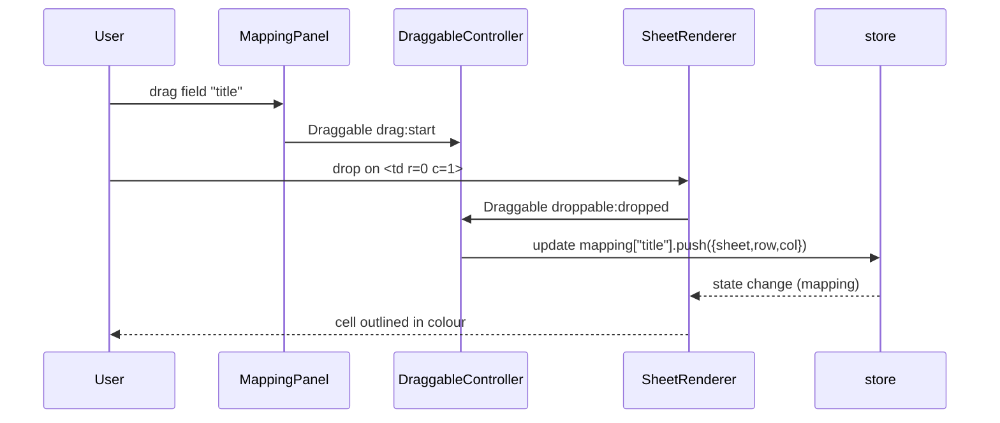
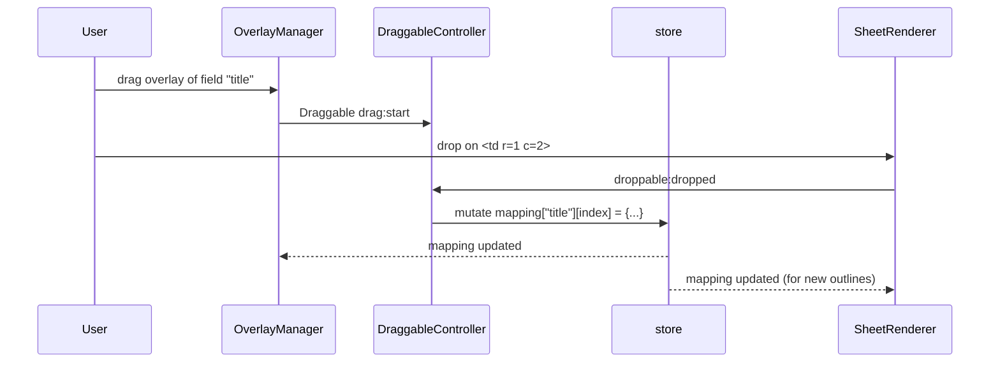

# Design Document – Draggable Field Mapping

## Overview

This document presents the high-level design for the **Draggable Field Mapping** feature, which replaces the existing native HTML-5 drag-and-drop interaction with the Shopify **Draggable** library and introduces a guided “Next” workflow.  The solution delivers:

* Mobile-, touch- and keyboard-friendly drag operations.
* Visually rich drag mirrors that eliminate the “selected-text” artefact.
* A “Next” button that snapshots the current mapping, advances focus to the next schema field and builds an ordered result array.
* Post-drop overlays that can themselves be dragged to correct mapping mistakes.

The change is fully backward-compatible at the data level (`store.mapping`, template JSON, exporter) and satisfies all eight requirements in `requirements.md`.

## Architecture

At runtime the feature introduces three new modules and augments two existing ones:

```
┌──────────────────┐        ┌─────────────────────┐        ┌────────────────────┐
│ MappingPanel     │──────▶│ Draggable Controller │──────▶│ SheetRenderer       │
│  (drag sources)  │        │  (new)              │        │  (drop targets)     │
└──────────────────┘        └─────────────────────┘        └────────────────────┘
                                │                          ▲
                                │overlays (new)            │cell highlights
                                ▼                          │
                         ┌────────────────┐                │
                         │ OverlayManager │────────────────┘
                         └────────────────┘
```

**Key points**

1. *Draggable Controller* wraps Shopify Draggable, initialising sensors and routing events to domain-specific callbacks.
2. *OverlayManager* owns absolutely-positioned `<div class="overlay">` elements representing each mapped cell.  Overlays are also draggable sources.
3. `store.currentFieldIndex` tracks which schema field is currently “active” for the “Next” workflow.

## Components and Interfaces

| Component | Responsibility | Interfaces / Events |
|-----------|---------------|---------------------|
| **MappingPanel** (existing) | Render schema fields, indicate focus, act as draggable **source list**. | Emits `drag:start`, `drag:stop` (via Draggable). Consumes `currentFieldIndex` from store. |
| **SheetRenderer** (existing) | Render worksheet as `<table>`; acts as droppable **grid**. Adds/removes cell outlines. | Listens for `droppable:dropped`, `droppable:returned` from Draggable. Exposes helper `tdFromEvent(evt)` to translate to `{row,col}`. |
| **DraggableController** (new) | One-time bootstrap that instantiates:<br>• `new Draggable.Draggable([...])` for field list.<br>• `new Draggable.Dropzone([...])` for table cells.<br>• `new Draggable.Draggable([...])` for overlays. | Publishes domain events (`FIELD_DROPPED`, `OVERLAY_MOVED`). Encapsulates Draggable API details. |
| **OverlayManager** (new) | Create, position and maintain overlays corresponding to `store.mapping`. Provide drag handles for correcting mappings. | Subscribes to store changes; exposes `render(mapping)`; fires `OVERLAY_MOVE_REQUEST` when a drag completes. |
| **NextButton** (existing *controls* div) | Validate mapping for current field, push snapshot to `store.records`, advance index, update focus state. | Reads/updates `currentFieldIndex`, `records`, `mapping`. |

### Event flow for first-time mapping



### Event flow for overlay repositioning



## Data Models

```ts
type CellAddress = { sheet: string; row: number; col: number };

interface StoreState {
  workbook: Workbook | null;
  schema: Schema | null;
  mapping: Record<string, CellAddress[]>; // unchanged
  records: Record<string, CellAddress[]>[]; // snapshots for array output
  currentFieldIndex: number;               // NEW – default 0
  errors: string[];
}
```

*No* changes are made to the on-disk template format or exporter contract – satisfying Requirement 6.

## Error Handling

| Scenario | Handling Strategy |
|----------|------------------|
| Drop outside any `<td>` | DraggableController listens to `droppable:returned` and does nothing, leaving mapping unchanged. |
| “Next” pressed with unmapped current field | NextButton flashes validation message and aborts the advance; Requirement 2.3. |
| Overlay drop onto a cell already hosting another mapping of the **same** field | Allowed → address is deduplicated; if duplicate the move is ignored. |
| Overlay drop that would exceed sheet bounds (shouldn’t happen via UI) | Guard clause in SheetRenderer verifies the coordinates before updating store; if invalid it cancels the move. |
| Performance regression (script >200 ms) | Lighthouse/DevTools CI budget check fails and blocks merge. |

## Testing Strategy

### Unit Tests (Jest + jsdom)

1. **Field drop** – simulate Draggable events; expect `store.mapping` updated and cell outlined.
2. **Next workflow** – mock mapping, click Next; expect snapshot in `records` and index increment.
3. **Overlay move** – programmatically fire `droppable:dropped` on overlay; assert mapping updated.
4. **Keyboard sensor** – fire key events (space, arrow) through Draggable’s KeyboardSensor mock; ensure drop succeeds.

### Integration / E2E (Cypress)

1. Drag with mouse, drop, click Next – verify JSON export contains the object.
2. Long-press touch simulation on mobile viewport – ensure mapping occurs.
3. Accessibility audit with `jest-axe` to ensure focus ring and aria attributes on draggable elements.

### Performance Tests

* Re-use `tests/performance.test.js`; extend to perform 100 drag-drop cycles on a 5 k-cell sheet and assert median scripting time < 200 ms.

### Cross-browser Matrix

GH Action runs Cypress headless in Chrome, Firefox, WebKit; manual smoke test checklist for Safari iOS + Chrome Android.
