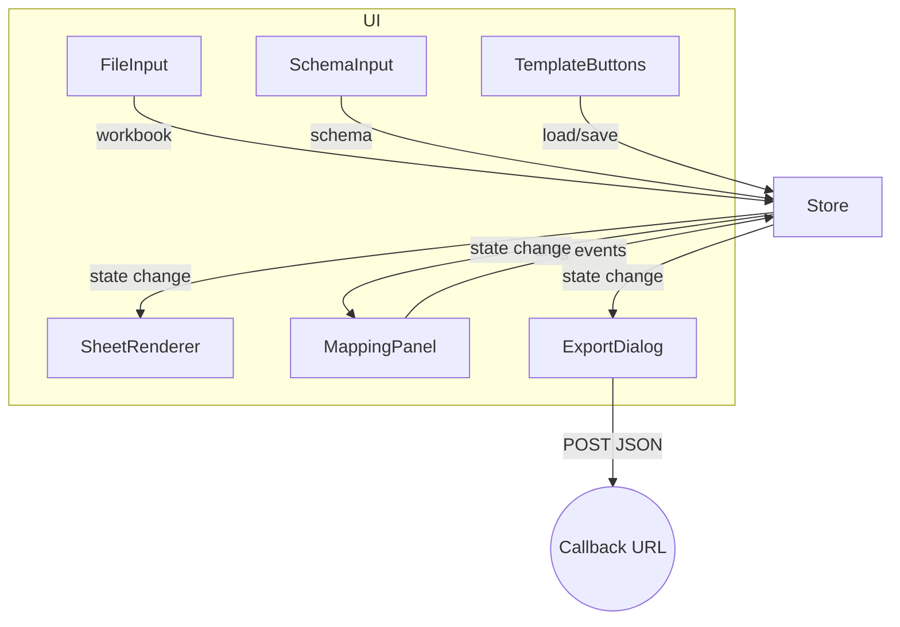

# Design Document – Sheet-to-JSON Mapper

## Overview

The Sheet-to-JSON Mapper is a **front-end-only** web tool that transforms arbitrary Excel/CSV security questionnaires into structured JSON according to a user-supplied schema.  The app loads workbooks in the browser (via SheetJS), renders the chosen sheet as an HTML table, overlays coloured highlights for each schema field, and lets users drag those highlights to map cells.  A completed mapping can be saved as a template or exported: the resulting JSON is posted to a callback URL.  Everything executes client-side, so no sensitive data leaves the user’s machine except the final payload.

## Architecture

The application follows a **modular, event-driven architecture** implemented with plain JavaScript (ES modules).  A lightweight in-memory *store* (observer pattern) tracks workbook, schema, and mapping state; UI components subscribe to state changes and update accordingly.



Key design choices:

1. **Single source of truth** – a central `Store` prevents inconsistent UI states.
2. **No framework** – avoids React/Vue overhead while meeting *front-end-only* constraint.
3. **SheetJS** – battle-tested parsing across `.xlsx`, `.xls`, `.csv` with browser support.
4. **Native HTML5 Drag-and-Drop** – smallest dependency surface for mapping UI.

## Components and Interfaces

| Component | Responsibility | External Libraries |
|-----------|----------------|--------------------|
| FileInput | Handles workbook upload; validates type & size. | File dialog API, SheetJS |
| WorkbookLoader | Parses workbook via SheetJS; normalises merged cells; emits `workbookLoaded`. | SheetJS |
| SchemaInput | Accepts/pastes JSON schema; syntax validation; emits `schemaLoaded`. | Native JSON.parse |
| Store | In-memory singleton holding `workbook`, `schema`, `mapping`, `template`. Publishes change events. | N/A |
| SheetRenderer | Renders selected worksheet as `<table>`; draws overlay layers for field highlights. | Virtual scroll lib (optional) |
| MappingPanel | Displays schema fields with colour swatches; handles drag source/target logic. | Native DnD API |
| AutoDetector | Runs baseline positional algorithm on `workbook+schema` and populates `Store.mapping`. | N/A |
| TemplateManager | Serialises/deserialises mapping templates; download/upload via `<a download>` & FileReader. | N/A |
| Exporter | Transforms mapping into JSON; validates against schema; posts to callback URL via `fetch`. | Fetch API |
| ErrorBanner | Global toast/banner component; subscribes to `Store.errors`. | N/A |

Interface contracts (TypeScript-style for clarity):

```ts
interface Mapping { [fieldName: string]: CellAddress[] }
interface CellAddress { sheet: string; row: number; col: number }
interface WorkbookState { sheets: string[]; activeSheet: string; data: Cell[][] }
interface SchemaField { name: string; type: string; /* trimmed subset of JSON Schema */ }
```

## Data Models

1. **Workbook** – normalised 2-D array of cells per sheet.  Merged regions are collapsed to a single `Cell` with `merged: {rows:number, cols:number}` metadata.
2. **Schema** – JSON object; only the top-level *properties* are required for mapping.
3. **Mapping** – `Mapping` dict linking schema field ➜ array of `CellAddress`es.
4. **Template File** – JSON `{ "fields": Mapping, "sheetName": string }` downloadable/uploadable.
5. **Export Payload** – JSON produced by reducing `Mapping` over the current worksheet, producing either scalar or array values per field; respects schema data types (string, number, boolean).

## Error Handling

| Scenario | Detection | User Feedback | Recovery |
|----------|-----------|---------------|----------|
| Unsupported/ corrupt file | SheetJS throws error | Modal with message “Unsupported or corrupt file.” | User selects new file |
| Invalid JSON schema | `JSON.parse` throws or schema lacks `properties` | Inline error in SchemaInput area | User corrects text |
| Missing mapping on *Complete* | Store detects unmapped field list | Dialog listing missing fields | User maps remaining fields |
| Network failure on POST | `fetch` rejects or returns !2xx | Banner: “Upload failed – Retry?” | Retry keeps mapping state |
| Template import mismatch | Cell addresses not found | Warning toast + highlight missing | User remaps or discards template |

All errors raise `Store.error` events consumed by `ErrorBanner`.

## Testing Strategy

1. **Unit Tests** (Jest)
   • WorkbookLoader – parse variants of `.xlsx`, `.xls`, `.csv` including merged cells & formulas.  
   • AutoDetector – given mock workbooks, verify predicted addresses.  
   • Exporter – mapping→JSON generation & schema conformance.

2. **Component Tests** (React-Testing-Library-style but vanilla JS harness)
   • SheetRenderer renders 500×50 grid within performance budget.  
   • MappingPanel drag-drop interaction updates `Store.mapping`.

3. **End-to-End Tests** (Cypress)
   • Happy path: load workbook → map → export → assert POST payload.  
   • Error path: corrupt file upload; network failure on POST.

4. **Performance Benchmarks**
   • Measure initial render time (<1 s for 500×50) using `performance.now()` in CI.  
   • Record interaction latency for drag events (<100 ms).

5. **Accessibility Checks**
   • Run Axe-core in CI for basic contrast & ARIA issues.  
   • Manual keyboard-only walkthrough.

---

All design elements above trace directly to the numbered requirements in `requirements.md`, ensuring functional coverage and measurable quality targets.
